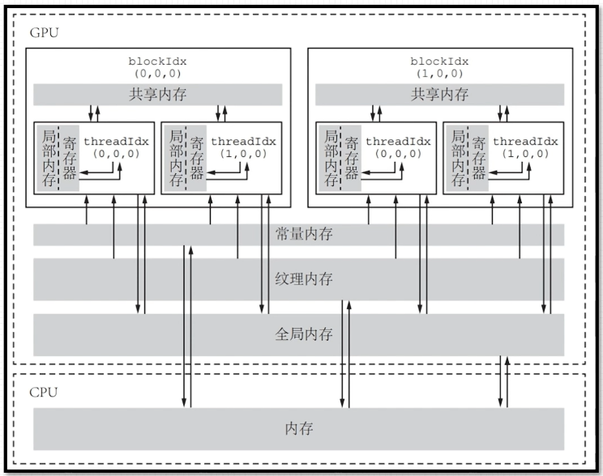
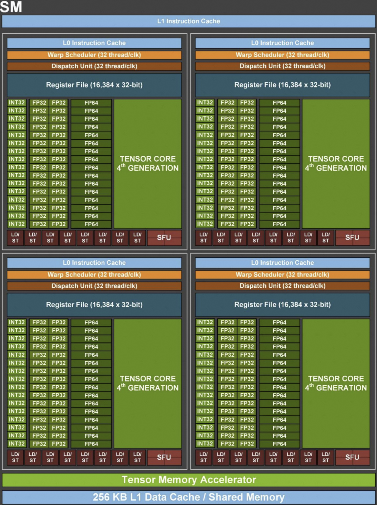

# CUDA内存体系结构和SM架构

# 1. CUDA内存体系结构

*表示可以先不care

- ### 全局内存（Global Memory）
    - 是我们常说的**显存**
    - 延迟最高、大小最大、最经常被使用，全局访问
    - cudaMemcpy函数就是将数据从CPU上拷贝到全局内存

- ### *常量内存（constant Memory）
    - 是一种具有cache缓存能力的特殊全局内存
    - 只读内存 数量有限
    - 通过kernel函数外用 __const__定义， cudaMemcpyToSymbol从主机端复制到常量内存cache中

- ### * 纹理内存（texture memory）和表面内存 (Surface Memory)
    - 类比常量内存 是一种具有cache缓存能力的特殊全局内存

- ### 寄存器 （regisiter）
    - 为各个线程所**私有**，访问最快，容量较小
    - 各种内建变量，如 gridDim、blockDim、blockIdx、 threadIdx 及 warpSize 都保存在特殊的寄存器中，以便高效访问

- ### 局部内存 (local memory)
    - 用法上： 类似于寄存器，为各个线程私有，当寄存器溢出时有可能就放在局部内存中
    - 物理上：等同于全局内存

- ### 共享内存 （Shared Memory）
    - 和寄存器类似，存在于芯片上（on-chip），速度上仅次于寄存器
    - 为各个block所私有，同一个block上的线程可以使用共享内存**通信**
    - 从设计上来说，共享内存存在的意义是针对常用的数据减少对于Gloabl Memroy的访问

以下表格以Turing架构的RTX2080的数据展示各个内存结构的访问速率

| 内存类型 | 存储位置 | 访问延迟 (Cycles) | 相对速度 (以全局内存为基准) | 特点 |
| --- | --- | --- | --- | --- |
| 寄存器 (Registers) | 片上 (On-chip) | ~0 (接近指令发射) | ~600x 快 | 每个线程私有，极速但容量极小 |
| 共享内存 (Shared Memory) | 片上 (On-chip) | ~19 - 33 | ~20x - 30x 快 | Block 内线程共享，需处理 Bank Conflict |
| L1 缓存 (L1 Cache) | 片上 (On-chip) | ~32 | ~20x 快 | 自动管理，与共享内存共用硬件资源 |
| L2 缓存 (L2 Cache) | 片内 (In-chip) | ~200 | ~3x 快 | 所有 SM 共享，全局内存的“缓冲垫” |
| 常量内存 (Constant) | 显存 (带缓存) | ~32 (命中时) | ~20x 快 | 广播模式下极快，未命中时等同全局内存 |
| 全局内存 (Global) | 显存 (DRAM) | 400 - 800 | 1x (参考基准) | 容量最大，最慢，建议通过向量化(FLOAT4)优化 |

- ### L1缓存和L2缓存
    - 从物理结构上看：L1≈共享内存 L2≈全局内存缓存 
    - 从编程上看：不是程序员能直接控制的
    - L1为SM所私有； L2为所有SM共有

# 2. SM架构

SM（Stream Multiprosessor）是CUDA架构中的核心，掌控着核心的计算资源和最高效的存储单元，一个独立的GPU上SM数量是有限的

一个SM通常包括如下的资源
- 一定数量的寄存器（分配给各个线程）
- 一定数量的共享内存（分配给各个block）（SM和block是一对多映射关系）
- 一定量的L1缓存
- 一定量的常量、纹理等缓存
- warp scheduler(线程束调度器)
- 计算资源 包括
    - INT32 FP32 FP64计算核心
    - Tensor Core 张量计算核心
    - Special Function Unit(SFU) 特殊函数核心
    - Load/Store (LD/ST)存储读写单元

下图是H100的SM架构图

下表列出了部分GPU的数据

| GPU | V100 | A100 | H100 | L40S |
| --- | --- | --- | --- | --- |
| GPU Architecture | Volta | Ampere | Hopper | Ada Lovelace |
| Memory Interface | 4096-bit HBM2 | 5120-bit HBM2 | 5120-bit HBM3 | GDDR6 |
| Memory Size | 32 GB / 16 GB | 40 GB | 80 GB | 48 GB |
| Memory Bandwidth | 900 GB/sec | 1555 GB/sec | 3000 GB/sec | 864 GB/s |
| SMs | 80 | 108 | 132 | 142 |
| Texture Units | 320 | 432 | 528 | 576 |
| L2 Cache Size | 6144 KB | 40 MB | 50 MB | 96MB |
| Shared Memory Size / SM | up to 96 KB | up to 164 KB | up to 228 KB | up to 128 KB |
| Register File Size / SM | 256 KB | 256 KB | 256 KB | 256 KB |
| Peak FP16 TFLOPS | 31.4 | 78 | 120 | 90.52 |